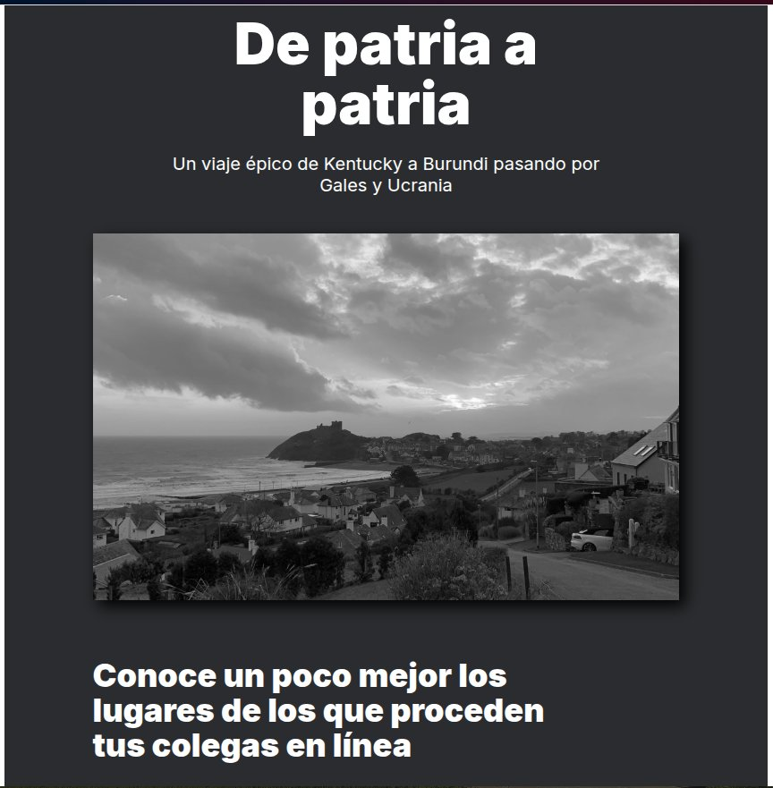
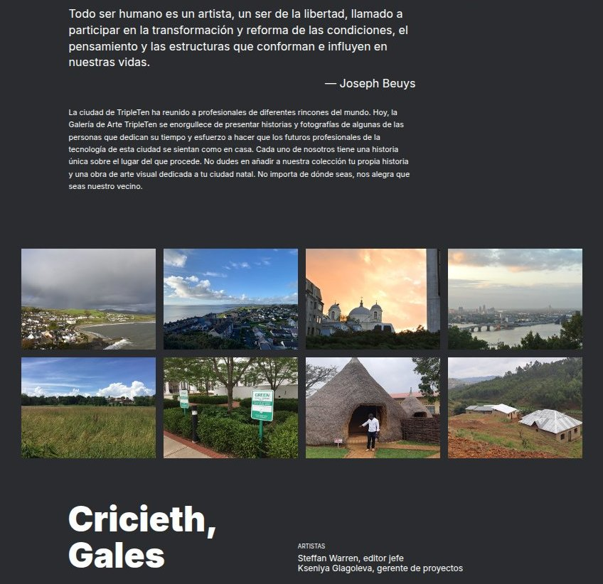
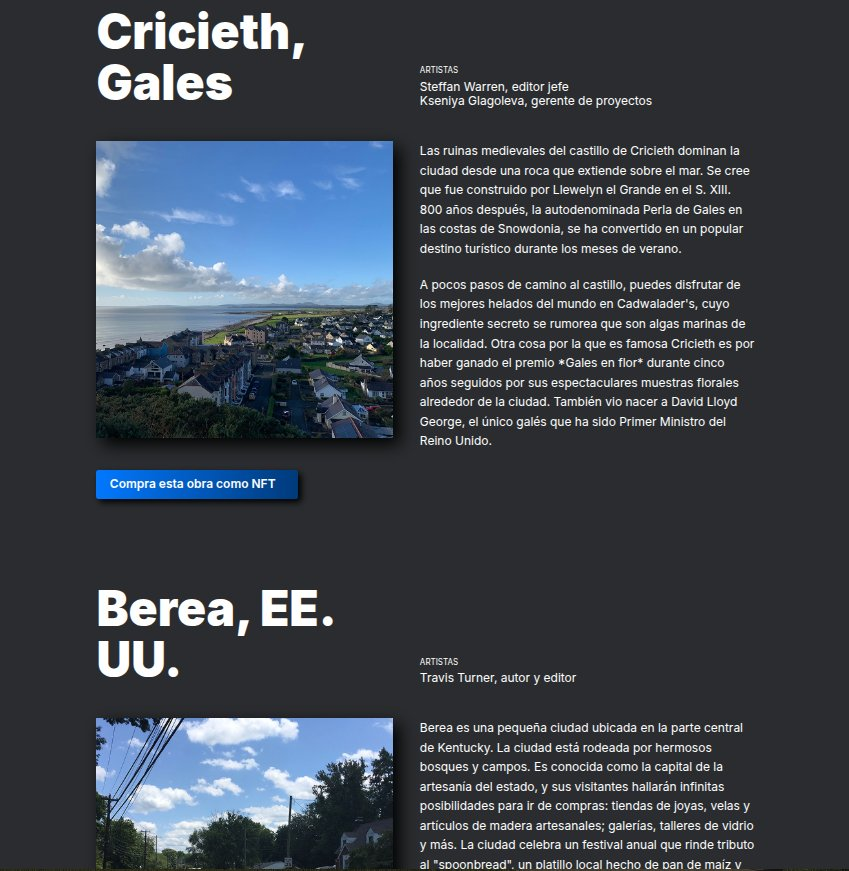
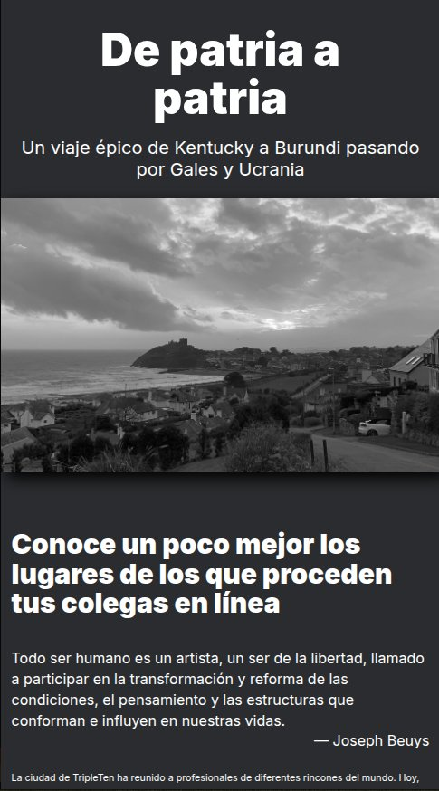
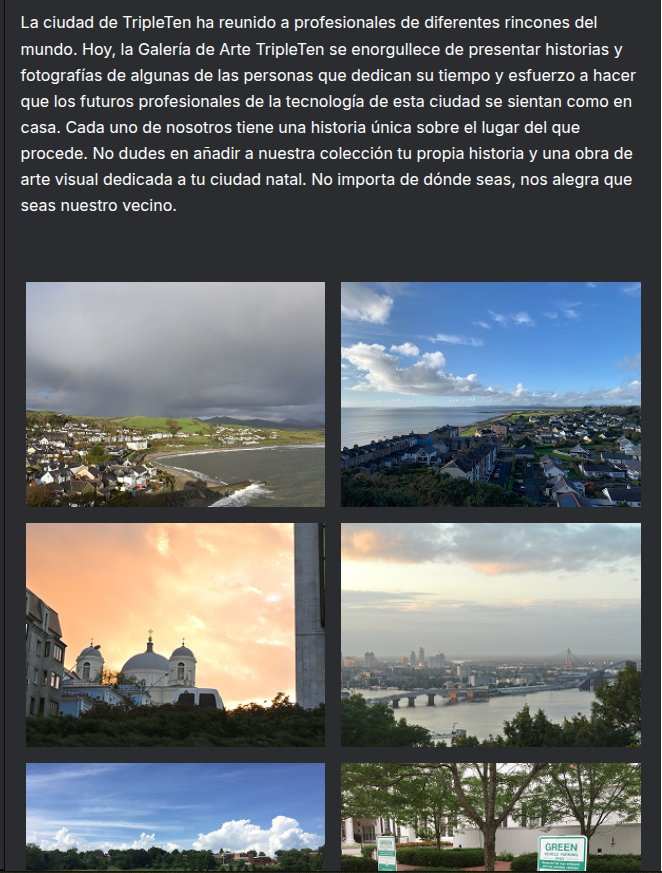
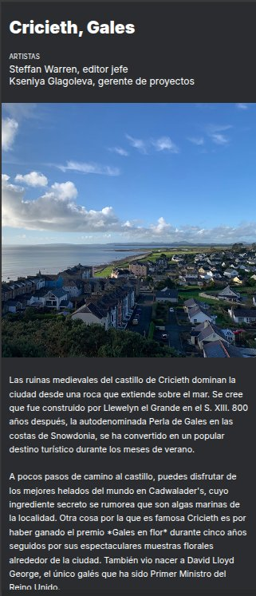

De patria a patria

Sitio web responsive que presenta una galería narrativa de lugares y culturas, enfocado en diseño adaptable y experiencia visual consistente en múltiples dispositivos.

🚀 Demo

👉 Live App: https://sergiovv2025.github.io/web_project_homeland/
👉 Repositorio: https://github.com/SergioVV2025/web_project_homeland

🎯 Enfoque

Proyecto centrado en la implementación de diseño responsive utilizando HTML y CSS, asegurando correcta visualización en distintos tamaños de pantalla.

Diseño responsivo completo:

Móvil: 320px
Tablet: 768px
Escritorio: 1280px

Puntos de ruptura específicos: 544px y 1024px

✨ Features

- Diseño completamente responsive
- Layout adaptativo con Grid y Flexbox
- Tipografía escalable
- Organización visual jerárquica
- Secciones narrativas con contenido multimedia

📸 Preview

### Top 1280px

### Middle 1280px

### Bottom 1280px

### Top 1024px

### Middle 1024px

### Bottom 544px

🛠️ Tech Stack

- HTML5
- CSS3
- Flexbox
- CSS Grid
- Media Queries
- Trabajo directo con Figma como brief de diseño.
- Fuente Inter (gratuita).
- Metodología BEM para organización de archivos.

🧠 Decisiones técnicas

- Uso de media queries para breakpoints clave
- Implementación de Grid para layouts complejos
- Uso de Flexbox para alineación de componentes

📚 Lecciones aprendidas

- Diseño responsive desde cero
- Manejo de layouts complejos sin frameworks
- Importancia de jerarquía visual
- Adaptación de contenido a distintos dispositivos

